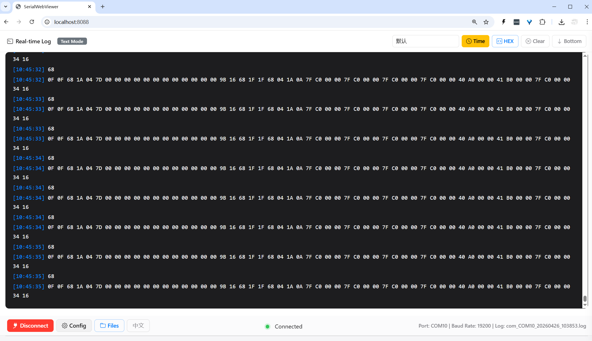
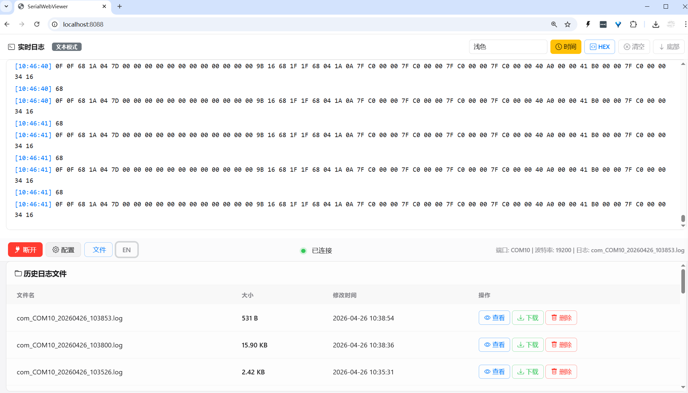

# SerialWebViewer

<div align="center">


**A Modern Web-based Serial Port Log Viewer**

[Features](#-features) • [Quick Start](#-quick-start) • [Usage](#-usage) • [Tech Stack](#-tech-stack)

</div>

---

## 📖 About

SerialWebViewer is a web-based serial port logging and viewing tool with real-time monitoring, multi-theme support, and bilingual interface (English/Chinese). It's perfect for embedded development, hardware debugging, and more.

## ✨ Features

### 🔌 Serial Port Management
- Multiple baud rate support (9600-115200)
- Configurable data bits, parity, stop bits
- RTS/DTR flow control support
- Auto-scan available serial ports
- Auto-save configuration

### 📊 Logging Features
- Real-time log display (SSE push)
- Text/HEX dual mode display
- Optional timestamp display
- Auto-save logs to files
- Historical log management (view, download, delete)

### 🎨 Interface Design
- **Modern UI**: Apple-style light theme
- **Multi-theme Support**: 9 preset themes + custom theme
- **Customizable**: Background, text, timestamp colors, and font size
- **Responsive Layout**: Adapts to different screen sizes
- **Internationalization**: Complete bilingual interface (EN/CN)

#### Screenshots

**Main Interface**


**Configuration Panel**


### 💾 Data Management
- Auto-record logs to files
- Time-stamped file naming
- Online historical log viewing
- One-click log download
- Latest files displayed first

## 🚀 Quick Start

### Installation

#### Windows
```bash
# Build
GOOS=windows GOARCH=amd64 go build -o SerialWebViewer.exe main.go

# Run
./SerialWebViewer.exe
```

#### Linux
```bash
# Build
go build -o serialwebviewer main.go

# Run
./serialwebviewer
```

#### macOS
```bash
# Build
GOOS=darwin GOARCH=amd64 go build -o SerialWebViewer.mac main.go

# Run
./SerialWebViewer.mac
```

### Usage

1. Launch the program and open `http://localhost:8088` in your browser
2. Click the "Config" button to open the configuration panel
3. Select serial port and baud rate, then click "Connect"
4. View real-time serial data
5. Switch display modes, themes, and languages as needed

## 📖 Usage

### Serial Configuration
| Parameter | Description | Options |
|-----------|-------------|---------|
| COM Port | Serial device | Auto-scan |
| Baud Rate | Data rate | 9600/19200/38400/57600/115200 |
| Data Bits | Data bits | 5/6/7/8 |
| Parity | Parity check | None/Odd/Even |
| Stop Bits | Stop bits | 1/2 |
| RTS | Request to Send | On/Off |
| DTR | Data Terminal Ready | On/Off |

### Theme List
- **Light** (Default): White background with black text, suitable for daytime
- **Default**: Dark gray background, eye-protection mode
- **Dracula**: Purple-toned dark theme
- **Nord**: Cold-toned Nordic style
- **Monokai**: Classic dark theme
- **Solarized Dark**: Eye-protection colors
- **GitHub Dark**: GitHub official dark theme
- **One Dark**: Atom editor style
- **Material**: Material Design style
- **Custom**: Fully customizable appearance

### Keyboard Shortcuts
- Click "Config": Toggle configuration panel
- Click "Files": Expand/collapse historical file list
- Select theme: Real-time switch log display theme

## 🛠️ Tech Stack

- **Backend**: Go 1.19+
- **Serial Communication**: go.bug.st/serial
- **Frontend**: Vanilla HTML/CSS/JavaScript
- **UI Framework**: Bootstrap 5
- **Icons**: Bootstrap Icons
- **Real-time Communication**: Server-Sent Events (SSE)

## 📁 Project Structure

```
SerialWebViewer/
├── main.go           # Main program file
├── go.mod            # Go module dependencies
├── go.sum            # Dependency checksum
├── logs/             # Log files directory
├── LICENSE           # MIT License
├── README.md         # Project documentation
└── .gitignore        # Git ignore file
```

## 🔧 Development

### Install Dependencies
```bash
go get go.bug.st/serial
```

### Build
```bash
# Windows
GOOS=windows GOARCH=amd64 go build -o SerialWebViewer.exe main.go

# Linux
go build -o serialwebviewer main.go

# macOS
GOOS=darwin GOARCH=amd64 go build -o SerialWebViewer.mac main.go
```

## 📝 Roadmap

- [ ] Multi-port simultaneous monitoring
- [ ] Data filtering and search
- [ ] Data export (CSV, JSON)
- [ ] Command-line parameter support
- [ ] Configuration import/export
- [ ] Data statistics and charts

## 🤝 Contributing

Issues and Pull Requests are welcome!

## 📄 License

This project is licensed under the [MIT](LICENSE) License.

## 👨‍💻 Author

**forqzy** - [GitHub](https://github.com/forqzy)

## 🙏 Acknowledgments

- [go.bug.st/serial](https://github.com/bugst/go-serial) - Serial communication library
- [Bootstrap](https://getbootstrap.com/) - UI framework
- [Bootstrap Icons](https://icons.getbootstrap.com/) - Icon library

---

<div align="center">

**Made with ❤️ by [forqzy](https://github.com/forqzy)**

</div>
